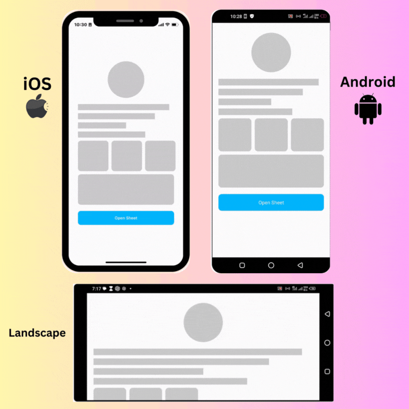

# React Native Bottom Sheet 💖

The smart 😎, tiny 📦, and flexible 🎗 bottom sheet your app craves 🚀



## ✨Features

- 📦 Very tiny and lightweight
- 0️⃣ No dependency (yeah!, just plug and play 😎)
- ✨ Modal and standard (non-modal) bottom sheet support
- ⌨ Smart & automatic keyboard and orientation handling for iOS & Android
- 💪 Imperative calls
- 📜 Supports FlatList, SectionList, ScrollView & View scrolling interactions
- 📟 Handles layout & orientation changes smartly
- 💯 Compatible with Expo
- 🔧 Flexible config
- 🚀 Supports props live update
- 🎞 Configurable animation
- 🎨 Follows Material Design principles
- 🌐 Runs on the web
- ✅ Written in TypeScript

## 💻 Installation

```sh
npm install @devvie/bottom-sheet
```

or

```sh
yarn add @devvie/bottom-sheet
```

## 📱 Minimal Usage
Opening and closing the bottom sheet is done imperatively, so just pass a `ref` to the bottom sheet and call the `open` or `close` methods via the `ref` instance to open and close the bottom sheet respectively. 

##### Examples

#### Typescript

```tsx
import React, { useRef } from 'react';
import BottomSheet, { BottomSheetMethods } from '@devvie/bottom-sheet';
import { Button } from 'react-native';

const App = () => {
  const sheetRef = useRef<BottomSheetMethods>(null);
  return (
    <Button title="Open" onPress={() => sheetRef.current.open()} />
    <BottomSheet ref={sheetRef}>
      <Text>
        The smart 😎, tiny 📦, and flexible 🎗 bottom sheet your app craves 🚀
      </Text>
    </BottomSheet>
  );
};

export default App;
```
#### Javascript

```tsx
import React, { useRef } from 'react';
import BottomSheet, { BottomSheetMethods } from '@devvie/bottom-sheet';
import { Button } from 'react-native';

const App = () => {
  const sheetRef = useRef(null);
  return (
    <Button title="Open" onPress={() => sheetRef.current.open()} />
    <BottomSheet ref={sheetRef}>
      <Text>
        The smart 😎, tiny 📦, and flexible 🎗 bottom sheet your app craves 🚀
      </Text>
    </BottomSheet>
  );
};
```

### ⚠ Warning
The bottom sheet component uses and handles pan gestures internally, so to avoid scroll/pan misbehavior with its container, **DO NOT** put it inside a container that supports panning e.g `ScrollView`. You can always  put it just next to the `ScrollView` and use `React Fragment` or a `View` to wrap them and everything should be okay.

#### ❌ Don't do this

```jsx
<ScrollView>
  <BottomSheet>
    ...
  </BottomSheet>
</ScrollView>
```

#### ✅ Do this
```jsx
<>
<ScrollView>
  ...
</ScrollView>

<BottomSheet>
  ...
</BottomSheet>
</>
```


## 🛠 Props
The bottom sheet is highly configurable via props. All props works for both `Android` and `iOS` except those prefixed with `android_` and `ios_`, which works for only `Android` and `iOS` respectively.

| Property                             | Type                                                                                                                                                                                                                             | Default                   | Description                                                                                                   | Required         |
| ------------------------------------ | -------------------------------------------------------------------------------------------------------------------------------------------------------------------------------------------------------------------------------- | -------------------------- | ------------------------------------------------------------------------------------------------------------- | ----------------- |
| `android_backdropMaskRippleColor`    | `string \| OpaqueColorValue`                                                                                                                                                                                                      |                            | Color of the ripple effect when backdrop mask is pressed (__Android Only__).                                     | No               |
| `android_closeOnBackPress`           | `boolean`                                                                                                                                                                                                                        | `true`                     | Determines whether the sheet will close when the device back button is pressed (__Android Only__).            | No               |
| `animationType`                      | `'slide' \| 'spring' \| 'fade' \| ANIMATIONS`                                                                                                                                                                                                     | `'slide'`                  | Animation to use when opening and closing the bottom sheet.                                                    | No               |
| `backdropMaskColor`                  | `string \| OpaqueColorValue`                                                                                                                                                                                                      | `'#00000052'`             | Color of the scrim or backdrop mask.                                                     | No               |
| `children`                           | `ViewProps['children'] \| React.FunctionComponent<{_animatedHeight: Animated.Value}>`                                                                                                                                           | `null`                     | Contents of the bottom sheet.                                                                                 | Yes              |
| `closeDuration`                      | `number`                                                                                                                                                                                                                         | `500`                      | Duration for sheet closing animation.                                                                         | No               |
| `closeOnBackdropPress`               | `boolean`                                                                                                                                                                                                                        | `true`                     | Determines whether the bottom sheet will close when the scrim or backdrop mask is pressed.                             | No               |
| `closeOnDragDown`                    | `boolean`                                                                                                                                                                                                                        | `true`                     | Determines whether the bottom sheet will close when dragged down.                                              | No               |
| `containerHeight`                    | `ViewStyle['height']`                                                                                                                                                                                                             | `DEVICE SCREEN HEIGHT`    | Height of the bottom sheet's overall container.                                                              | No               |
| `customBackdropComponent`            | `React.FunctionComponent<{_animatedHeight: Animated.Value}>`                                                                                                                                                                      | `null`                     | Custom component for sheet's scrim or backdrop mask.                                                          | No               |
| `customBackdropPosition`             | `"top" \| "behind"`                                                                                                                                                                                                              | `'behind'`                 | Determines the position of the custom scrim or backdrop component. `'behind'` puts it behind the keyboard and `'top'`` puts it atop the keyboard.                                                      | No               |
| `customDragHandleComponent`          | `React.FC<{_animatedHeight: Animated.Value}>`                                                                                                                                           |                            | Custom drag handle component to replace the default bottom sheet's drag handle.                               | No               |
| `customEasingFunction`               | `AnimationEasingFunction`                                                                                                                                                                                                         | `ANIMATIONS.SLIDE`         | Custom easing function for driving sheet's animation.                                                          | No               |
| `disableBodyPanning`                 | `boolean`                                                                                                                                                                                                                        | `false`                    | Prevents the bottom sheet from being dragged/panned down on its body.                                          | No               |
| `disableDragHandlePanning`           | `boolean`                                                                                                                                                                                                                        | `false`                    | Prevents the bottom sheet from being panned down by dragging its drag handle.                                   | No               |
| `dragHandleStyle`                    | `ViewStyle`                                                                                                                                                                                                                      |                            | Extra styles to apply to the drag handle.                                                                     | No               |
| `height`                             | `number \| string`                                                                                                                                                                                                               | `'50%'`                    | Height of the bottom sheet when opened. Relative to `containerHeight` prop                                                                   | No               |
| `hideDragHandle`                     | `boolean`                                                                                                                                                                                                                        | `false`                    | When true, hides the sheet's drag handle.                                                                     | No               |
| `modal`                              | `boolean`                                                                                                                                                                                                                        | `true`                     | Determines whether the sheet is a modal. A modal sheet has a scrim or backdrop mask, while a standard (non-modal) sheet doesn't.                                                                   | No               |
| `openDuration`                       | `number`                                                                                                                                                                                                                         | `500`                      | Duration for sheet opening animation.                                                                         | No               |
| `style`                              | `Omit<ViewStyle, 'height' \| 'minHeight' \| 'maxHeight' \| 'transform:[{translateY}]'>`                                                                                                                                        |                            | Extra styles to apply to the bottom sheet.                                                                    | No               |

## Examples
Flexibility is a focus for this bottom sheet, these few examples shows certain behaviors of the bottom sheet and what can be achieved by tweaking its props.

### 1️⃣ Smart response to keyboard pop ups and orientation changes (_automatic behavior_)
Android            |  iOS
:-------------------------:|:-------------------------:
  |  

### 2️⃣ Handles deeply nested list and scroll views interactions (_automatic beavior_)
Android            |  iOS
:-------------------------:|:-------------------------:
  |  
### 3️⃣ Auto adjusts layout when `height` and `containerHeight` props change (_automatic behavior_)

### 4️⃣ Extend sheet height when its content is scrolled

### 5️⃣ Use as `SnackBar`

### 6️⃣ Custom Drag Handle Animation Interpolation

### 7️⃣ Custom Scrim/Backdrop Mask


#### _More Examples and code samples comign soon..._

## Contributing

See the [contributing guide](CONTRIBUTING.md) to learn how to contribute to the repository and the development workflow.

## License

MIT

see [LICENSE](LICENSE.md)

---

</> with 💖 by [Devvie](https://twitter.com/stanleyugwu_) ✌
